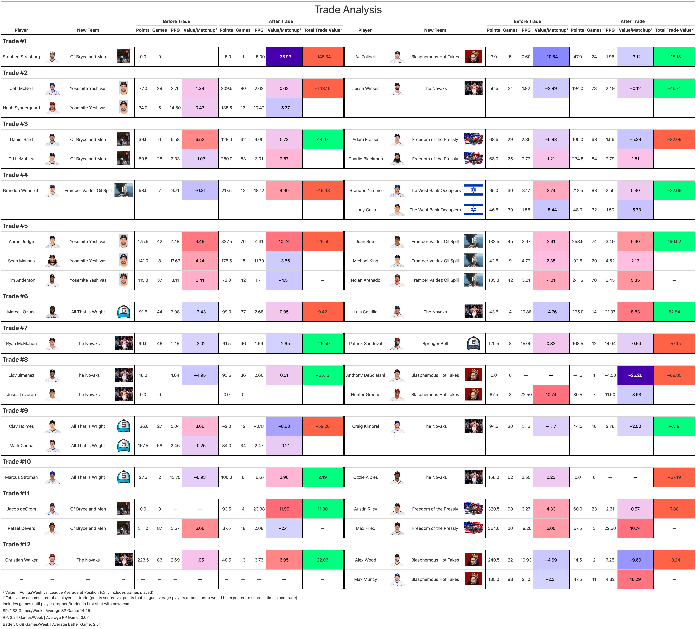

<style type="text/css">
.main-container {
  max-width: 1600px;
  max-height: 900px;
  width: 100%;
  height: auto
  margin-left: auto;
  margin-right: auto;
}
</style>

```{r setup, include=FALSE}
knitr::opts_chunk$set(echo = F, warning = F, message = F, error = F)

library(jsonlite)
library(tidyverse)
library(gt)
library(furrr)
library(glue)
library(lubridate)
library(here)
library(patchwork)
plan(multiprocess(workers = parallel::detectCores() - 1))
Sys.setenv("VROOM_CONNECTION_SIZE" = 131072 * 2000)

theme_set(theme_bw() + 
            theme(plot.title = element_text(size = 20, hjust = 0.5),
                  axis.title = element_text(size = 16),
                  plot.subtitle = element_text(size = 16, hjust = 0.5),
                  strip.text = element_text(size = 12),
                  legend.position = "none")
)
set.seed(123)

source('helpers.R')
source('data/daily_stats.R')
source('figures/wp_graphics.R')
source('data/trades.R')
```

```{r}
df_start <- 
  read_csv('data/df_start.csv') %>% 
  filter(season == params$season) %>% 
  filter(season != params$current_season | !playoffs)

n_games <- max(df_start$matchup_id)
n_match <- n_games * 6

### Get data
y <- robust_scrape(glue('http://fantasy.espn.com/apis/v3/games/flb/seasons/{params$season}/segments/0/leagues/49106?view=mTeam'))

### Teams
teams <- jsonlite::flatten(y$teams)
teams <- 
  select(teams, 
         'team_id' = id,
         'division_id' = divisionId,
         location,
         nickname,
         logo,
         'owners' = owners,
         'abbreviation' = abbrev,
         'wins' = record.overall.wins,
         'losses' = record.overall.losses,
         'ties' = record.overall.ties) %>% 
  mutate('team' = paste(location, nickname)) %>% 
  mutate('owners' = map_chr(teams$owners, ~paste0(.x, collapse = ', '))) %>% 
  select(team_id, division_id, team, everything())

teams$logo[which(teams$team == "The Traveling Secretaries")] <- 'https://i.imgur.com/wll1Ubw.jpg'
teams$logo[which(teams$team == 'Mt. Everest Taquito Farmers')] <-  'https://i.imgur.com/VW41hvO.gif'
write_csv(teams, glue('data/stats/{params$season}/teams_{params$season}.csv'))

### Schedule and Batting + Pitching Points
home_schedule <- NULL
away_schedule <- NULL
schedule <- NULL
batter_points <- sp_points <- rp_points <-  NULL

for(i in 1:n_games) {
  sp_id <- df_start$end_period[i]
  x <- robust_scrape(glue("http://fantasy.espn.com/apis/v3/games/flb/seasons/{params$season}/segments/0/leagues/49106?scoringPeriodId={sp_id}&view=mBoxscore"))
  
  
  schedule_ <- x$schedule
  home <- schedule_$home %>% dplyr::slice(1:n_match) 
  away <- schedule_$away %>% dplyr::slice(1:n_match)
  
  schedule_ <- select(schedule_,
                      'matchup_id' = matchupPeriodId,
                      'game_id' = id) %>% dplyr::slice(1:n_match)
  
  home_schedule_ <- 
    select(home, 
           'home_team_id' = teamId,
           'home_total_points' = totalPoints) %>% 
    mutate("home_batting_points" = map_dbl(home$rosterForMatchupPeriod$entries, get_batting_points)) %>% 
    mutate("home_pitching_points" = home_total_points - home_batting_points) 
  
  away_schedule_ <- 
    select(away, 
           'away_team_id' = teamId,
           'away_total_points' = totalPoints) %>% 
    mutate("away_batting_points" = map_dbl(away$rosterForMatchupPeriod$entries, get_batting_points)) %>% 
    mutate("away_pitching_points" = away_total_points - away_batting_points) 
  
  
  batter_points_ <- 
    map2_dfr(home$rosterForMatchupPeriod$entries, 1:n_match, batting_points_by_game) %>% 
    mutate('team_id' = home$teamId[team_ix]) %>% 
    bind_rows(
      map2_dfr(away$rosterForMatchupPeriod$entries, 1:n_match, batting_points_by_game) %>% 
        mutate('team_id' = away$teamId[team_ix])
    )
  batter_points <- bind_rows(batter_points, batter_points_)
  
  
  rp_points_ <- 
    map2_dfr(home$rosterForMatchupPeriod$entries, 1:n_match, rp_points_by_game) %>% 
    mutate('team_id' = home$teamId[team_ix]) %>% 
    bind_rows(
      map2_dfr(away$rosterForMatchupPeriod$entries, 1:n_match, rp_points_by_game) %>% 
        mutate('team_id' = away$teamId[team_ix])
    )
  rp_points <- bind_rows(rp_points, rp_points_)
  
  
  sp_points_ <- 
    map2_dfr(home$rosterForMatchupPeriod$entries, 1:n_match, sp_points_by_game) %>% 
    mutate('team_id' = home$teamId[team_ix]) %>% 
    bind_rows(
      map2_dfr(away$rosterForMatchupPeriod$entries, 1:n_match, sp_points_by_game) %>% 
        mutate('team_id' = away$teamId[team_ix])
    )
  sp_points <- bind_rows(sp_points, sp_points_)
  
  schedule_ <- bind_cols(schedule_, home_schedule_, away_schedule_) %>% 
    mutate_if(is.numeric, function(x) replace(x, x == 0, NA))
  
  
  schedule_ <- 
    schedule_ %>% 
    left_join(select(teams, "home_team" = team, team_id), by = c('home_team_id'= 'team_id')) %>% 
    left_join(select(teams, "away_team" = team, team_id), by = c('away_team_id'= 'team_id')) %>% 
    filter(matchup_id == i)
  
  schedule <- bind_rows(schedule, schedule_)
}


### Update Daily Stats
if(params$season == params$current_season) {
  if(params$matchup_id == 1) {
    write_csv(get_matchup_stats(params$matchup_id, season = params$season),
              glue('data/stats/{params$season}/daily_stats_{params$season}.csv'))
  } else {
    read_csv(glue('data/stats/{params$season}/daily_stats_{params$season}.csv')) %>%
      filter(matchup_id < params$matchup_id) %>%
      bind_rows(get_matchup_stats(params$matchup_id, season = params$season)) %>%
      write_csv(glue('data/stats/{params$season}/daily_stats_{params$season}.csv'))
  }
}

df_daily <- read_csv(glue('data/stats/{params$season}/daily_stats_{params$season}.csv'))

relief_starts <- 
  df_daily %>% 
  filter(in_lineup) %>% 
  filter(pitcher) %>% 
  group_by(player, player_id, team_id, matchup_id) %>% 
  summarise('sp_games' = sum(start),
            'rp_games' = sum(relief) - sum(relief_start),
            'relief_starts' = sum(relief_start),
            'sp_points' = sum(points[start], na.rm = T),
            'rp_points' = sum(points[relief & !relief_start], na.rm = T)) %>% 
  filter((sp_games > 0 & rp_games > 0) | relief_starts > 0) %>% 
  ungroup()

df_penalty <- 
  df_daily %>%
  filter(in_lineup) %>%
  inner_join(df_start, by = 'matchup_id') %>%
  mutate('day_of_matchup' = scoring_period_id - start_period + 1) %>%
  mutate('days_left' = end_period - scoring_period_id) %>%
  group_by(matchup_id, team_id, day_of_matchup, days_left, start_cap, scoring_period_id) %>%
  summarise('day_points' = sum(points),
            'start_points' = sum(points[start], na.rm = T),
            'starts' = sum(start),
            'batting_points' = sum(points[batter]),
            'pitching_points' = sum(points[pitcher])) %>%
  group_by(matchup_id, team_id) %>%
  mutate('total_starts' = cumsum(starts)) %>% 
  mutate('over_start_cap' = total_starts > start_cap & lag(total_starts) <= start_cap ) %>% 
  mutate('penalty' = ifelse(!over_start_cap, 0, sign(start_points) * plyr::round_any((total_starts - start_cap)/starts * abs(start_points), 0.5, ceiling))) %>%
  select(matchup_id, team_id, penalty, scoring_period_id) %>% 
  inner_join(select(teams, team, team_id)) %>% 
  filter(penalty != 0) %>% 
  distinct() %>% 
  ungroup() %>% 
  select(team, matchup_id, scoring_period_id, penalty) 


### Relief Starts
for(i in 1:nrow(relief_starts)) {
  week <- relief_starts$matchup_id[i]
  player <- relief_starts$player[i]
  ix_rp <- which(rp_points$player == player & rp_points$matchup_id == week)
  ix_sp <- which(sp_points$player == player & sp_points$matchup_id == week)
  rp_points$n_points[ix_rp] <- relief_starts$rp_points[i]
  rp_points$n_games[ix_rp] <- relief_starts$rp_games[i]
  sp_points$n_points[ix_sp] <- relief_starts$sp_points[i]
  sp_points$n_games[ix_sp] <- relief_starts$sp_games[i]
}

write_csv(schedule, glue('data/stats/{params$season}/schedule_{params$season}.csv'))
write_csv(batter_points, glue('data/stats/{params$season}/batting_weekly_{params$season}.csv'))
write_csv(sp_points, glue('data/stats/{params$season}/sp_weekly_{params$season}.csv'))
write_csv(rp_points, glue('data/stats/{params$season}/rp_weekly_{params$season}.csv'))

### Trades
if(params$season == params$current_season) {
  if(params$matchup_id == 1) {
    df_trades <- get_trades(params$matchup_id)
  } else {
    df_trades <-
      read_csv(glue('data/stats/{params$season}/trades_{params$season}.csv')) %>%
      filter(matchup_id < params$matchup_id) %>%
      bind_rows(get_trades(params$matchup_id))
  }
  write_csv(df_trades, glue('data/stats/{params$season}/trades_{params$season}.csv'))
  
  
  traded_players <- get_trade_players(df_trades)
  write_csv(traded_players, glue('data/stats/{params$season}/traded_players_{params$season}.csv'))
}
```

```{r}
### Team points by week
team_points <- 
  select(schedule, contains("home"), matchup_id, game_id) %>% 
  rename_with(function(x) gsub("home_", "", x)) %>% 
  bind_rows(
    select(schedule, contains("away"), matchup_id, game_id) %>% 
      rename_with(function(x) gsub("away_", "", x))
  )

team_points <- 
  team_points %>% 
  mutate("adj_pts" = case_when(
    matchup_id == 1 ~ total_points * 7/11,
    matchup_id == 14 ~ total_points * 7/10,
    matchup_id == params$matchup_id & params$midweek ~ 7/(wday(Sys.Date()-2)) * total_points,
    T ~ total_points)) %>% 
  mutate("adj_batting_pts" = case_when(
    matchup_id == 1 ~ batting_points * 7/11,
    matchup_id == 14 ~ batting_points * 7/10,
    matchup_id == params$matchup_id & params$midweek ~ 7/(wday(Sys.Date()-2)) * batting_points,
    T ~ batting_points)) %>% 
  mutate("adj_pitching_pts" = case_when(
    matchup_id == 1 ~ pitching_points * 7/11,
    matchup_id == 14 ~ pitching_points * 7/10,
    matchup_id == params$matchup_id & params$midweek ~ 7/(wday(Sys.Date()-2)) * pitching_points,
    T ~ pitching_points)) 

team_points <- 
  team_points %>% 
  left_join(team_points, 
            by = c('matchup_id', 'game_id'),
            suffix = c("", "_opp")) %>% 
  filter(team != team_opp) 

total_team_points <- 
  team_points %>% 
  filter(matchup_id <= params$matchup_id) %>% 
  group_by(team) %>%
  summarise("total_points" = sum(total_points, na.rm = T),
            "batting_points" = sum(batting_points, na.rm = T),
            "pitching_points" = sum(pitching_points, na.rm = T),
            "adj_batting_pts" = mean(adj_batting_pts, na.rm = T),
            "adj_pitching_pts" = mean(adj_pitching_pts, na.rm = T),
            'adj_pts' = mean(adj_pts, na.rm = T))


### Summary Stats mean points by week
mean_pts_by_week <- 
  group_by(team_points, matchup_id) %>%
  summarise("adj_pts" = mean(adj_pts),
            "adj_batting_pts" = mean(adj_batting_pts),
            "adj_pitching_pts" = mean(adj_pitching_pts))

### Weekly ranks
team_points <- 
  group_by(team_points, matchup_id) %>% 
  mutate("overall_rank" = rank(desc(total_points), ties.method = 'average'),
         "batting_rank" = rank(desc(batting_points), ties.method = 'average'),
         "pitching_rank" = rank(desc(pitching_points), ties.method = 'average')) %>% 
  ungroup()


### Batter points per game
batter_ppg <- 
  batter_points %>% 
  filter(matchup_id <= params$matchup_id) %>%
  filter(!is.na(n_games)) %>% 
  inner_join(select(teams, team_id, team)) %>% 
  group_by(team) %>% 
  summarise("batting_ppg" = sum(n_points)/sum(n_games),
            'n_games' = sum(n_games),
            'total' = sum(n_points)) %>% 
  arrange(desc(batting_ppg)) 

### rp points per game
rp_ppg <- 
  rp_points %>% 
  filter(matchup_id <= params$matchup_id) %>% 
  filter(!is.na(n_games)) %>% 
  inner_join(select(teams, team_id, team)) %>% 
  group_by(team) %>% 
  summarise("rp_ppg" = sum(n_points)/sum(n_games),
            'n_games' = sum(n_games),
            'total' = sum(n_points)) %>% 
  arrange(desc(rp_ppg)) 

### SP Points Per Game
sp_ppg <- 
  sp_points %>% 
  filter(matchup_id <= params$matchup_id) %>% 
  filter(!is.na(n_games)) %>% 
  inner_join(select(teams, team_id, team)) %>% 
  group_by(team) %>% 
  summarise("sp_ppg" = sum(n_points)/sum(n_games),
            'n_games' = sum(n_games),
            'total' = sum(n_points)) %>% 
  arrange(desc(sp_ppg)) 

### SP Points Per Game
qs_pct <- 
  sp_points %>% 
  filter(matchup_id <= params$matchup_id) %>% 
  filter(!is.na(n_games)) %>% 
  inner_join(select(teams, team_id, team)) %>% 
  group_by(team) %>% 
  summarise("qs_pct" = sum(n_qs)/sum(n_games),
            'n_games' = sum(n_games),
            'n_qs' = sum(n_qs)) %>% 
  arrange(desc(qs_pct)) 


### Exp Record
exp_standings <- 
  team_points %>% 
  filter(matchup_id <= params$matchup_id) %>% 
  group_by(team) %>% 
  summarise(
    "win_pct" = mean(total_points > total_points_opp, na.rm = T) + 0.5 * mean(total_points == total_points_opp, na.rm = T),
    "exp_win_pct" = mean((12 - overall_rank)/11, na.rm = T),
    'win' = sum(total_points > total_points_opp, na.rm = T) + 0.5 * sum(total_points == total_points_opp, na.rm = T),
    'loss' = params$matchup_id - win,
    "exp_win" = sum((12 - overall_rank)/11, na.rm = T),
    "exp_loss" = params$matchup_id - exp_win) %>% 
  inner_join(select(teams, team, division_id, logo)) %>% 
  inner_join(total_team_points) %>% 
  left_join(batter_ppg %>% select(-n_games, -total)) %>% 
  left_join(rp_ppg %>% select(-n_games, -total)) %>% 
  left_join(sp_ppg %>% select(-n_games, -total)) %>% 
  left_join(qs_pct %>% select(-n_games, -n_qs)) %>% 
  arrange(-win_pct, -total_points) %>% 
  mutate('rank' = 1:12)

league_avg <-  
  tibble('team' = 'League Average',
         'division_id' = NA,
         'win' = NA,
         'loss' = NA,
         'exp_win' = NA,
         'exp_loss' = NA,
         'batting_ppg' = weighted.mean(batter_ppg$batting_ppg, batter_ppg$n_games),
         'sp_ppg' = weighted.mean(sp_ppg$sp_ppg, sp_ppg$n_games),
         'rp_ppg' = weighted.mean(rp_ppg$rp_ppg, rp_ppg$n_games),
         'adj_batting_pts' = mean(exp_standings$adj_batting_pts),
         'adj_pitching_pts' = mean(exp_standings$adj_pitching_pts),
         'adj_pts' = mean(exp_standings$adj_pts),
         'batting_points' = mean(exp_standings$batting_points),
         'pitching_points' = mean(exp_standings$pitching_points),
         'total_points' = mean(exp_standings$total_points), 
         'qs_pct' = weighted.mean(qs_pct$qs_pct, qs_pct$n_games))


exp_standings <- bind_rows(exp_standings, league_avg)
```

```{r}
### playoff simulations
mu <- mean(team_points$adj_pts, na.rm = T)
sigma <- sd(team_points$adj_pts, na.rm = T)

team_mus <- 
  group_by(team_points, team) %>% 
  summarise("mean_pts" = mean(adj_pts, na.rm = T),
            "games_played" = max(matchup_id[!is.na(total_points)])) %>% 
  mutate("team_mu" = min(1, games_played/20) * mean_pts  + max(0, (1 - games_played/20)) * mu) %>% 
  pull(team_mu)

team_sigmas <- 
  group_by(team_points, team) %>% 
  summarise("sd_pts" = sd(adj_pts, na.rm = T),
            "games_played" = max(matchup_id[!is.na(total_points)])) %>% 
  mutate("team_sigma" = min(1, games_played/20) * sd_pts  + max(0, (1 - games_played/20)) * sigma) %>% 
  pull(team_sigma)
team_sigmas[is.na(team_sigmas)] <- sigma

names(team_mus) <- sort(unique(team_points$team))
names(team_sigmas) <- sort(unique(team_points$team))

if(params$midweek) {
  na_ix <- is.na(schedule$home_total_points)
} else {
  na_ix <- schedule$matchup_id > params$matchup_id 
}


df_sims <- future_map_dfr(1:params$nsims, sim_season)

df_sims <- 
  select(df_sims, contains("home"), matchup_id, game_id, sim_id) %>% 
  rename_with(function(x) gsub("home_", "", x)) %>% 
  bind_rows(
    select(df_sims, contains("away"), matchup_id, game_id, sim_id) %>% 
      rename_with(function(x) gsub("away_", "", x))
  )


df_sims <- 
  df_sims %>% 
  select(-contains('batting'), -contains('pitching')) %>% 
  left_join(df_sims %>% select(-contains('batting'), -contains('pitching')),
            by = c('matchup_id', 'game_id', 'sim_id'),
            suffix = c("", "_opp")) %>% 
  filter(team != team_opp)  %>% 
  left_join(select(teams, team_id, division_id), by  = 'team_id')

x <- 
  df_sims %>% 
  group_by(team, division_id, sim_id) %>% 
  summarise('wins' = sum(total_points > total_points_opp),
            'points' = sum(total_points)) %>% 
  ungroup() 

x <- 
  group_by(x, sim_id) %>% 
  group_by(sim_id) %>% 
  mutate("playoffs" = get_playoffs(wins, points)) %>% 
  mutate('last_place' = get_last_place(wins, points))

sim_results <- 
  group_by(x, team) %>% 
  summarise("mean_wins" = round(mean(wins), 1),
            "mean_pts" = round(mean(points)),
            "playoffs" = mean(playoffs),
            'last_place' = mean(last_place))

read_csv(glue('data/playoff_odds/historical_playoff_odds_{params$season}.csv')) %>%
  filter(matchup_id != params$matchup_id) %>%
  bind_rows(sim_results %>% mutate('matchup_id' = params$matchup_id)) %>%
  write_csv(glue('data/playoff_odds/historical_playoff_odds_{params$season}.csv'))
```


### Advanced Standings
```{r}
df <-
  select(exp_standings,
         team,
         logo,
         win,
         loss,
         exp_win,
         exp_loss,
         batting_ppg,
         sp_ppg,
         rp_ppg,
         adj_batting_pts,
         adj_pitching_pts,
         adj_pts,
         batting_points,
         pitching_points,
         total_points,
         qs_pct, 
         rank) %>%
  left_join(sim_results) %>% 
  arrange(-exp_win, -total_points) 

df$team[1:12] <-  paste0(df$team[1:12], ' (', df$rank[1:12], ')')
df$logo[13] <- 'https://i.imgur.com/h3Vd6b8.png'
df$mean_pts[13] <- mean(df$mean_pts[1:12])
df <- select(df, -rank)


gt1 <-
  gt(df) %>%
  
  ### Round Numbers
  fmt_number(columns = c(exp_win, exp_loss, mean_wins), decimals = 1, sep_mark = '') %>%
  fmt_number(columns = c(win, loss), decimals = 1, sep_mark = '', drop_trailing_zeros = T, drop_trailing_dec_mark = T) %>%
  fmt_number(columns = c(mean_pts), decimals = 0, sep_mark = '') %>%
  fmt_number(columns = c(sp_ppg, rp_ppg, adj_pts, adj_batting_pts, adj_pitching_pts, batting_points, pitching_points, total_points), decimals = 1, sep_mark = '') %>%
  fmt_number(columns = c(batting_ppg), decimals = 2, sep_mark = '') %>%
  fmt_percent(columns = c(qs_pct, playoffs, last_place), decimals = 1, sep_mark = '') %>%
  fmt_missing(columns = everything(), missing_text = "---") %>%
  
  ### Align Columns
  cols_align(align = "center", columns = everything()) %>%
  
  ### Colors
  data_color(columns = c(win, loss, exp_win, exp_loss),
             colors = scales::col_numeric(palette = ggsci::rgb_material('amber', n = 100), domain = c(0, params$matchup_id))) %>%
  data_color(columns = c(batting_points),
             colors = scales::col_numeric(palette = ggsci::rgb_material('amber', n = 100), domain = range(df$batting_points, na.rm = T))) %>%
  data_color(columns = c(pitching_points),
             colors = scales::col_numeric(palette = ggsci::rgb_material('amber', n = 100), domain = range(df$pitching_points, na.rm = T))) %>%
  data_color(columns = c(total_points),
             colors = scales::col_numeric(palette = ggsci::rgb_material('amber', n = 100), domain = range(df$total_points, na.rm = T))) %>%
  data_color(columns = c(batting_ppg),
             colors = scales::col_numeric(palette = ggsci::rgb_material('amber', n = 100), domain = range(df$batting_ppg, na.rm = T))) %>%
  data_color(columns = c(rp_ppg),
             colors = scales::col_numeric(palette = ggsci::rgb_material('amber', n = 100), domain = range(df$rp_ppg, na.rm = T))) %>%
  data_color(columns = c(sp_ppg),
             colors = scales::col_numeric(palette = ggsci::rgb_material('amber', n = 100), domain = range(df$sp_ppg, na.rm = T))) %>%
  data_color(columns = c(adj_pts),
             colors = scales::col_numeric(palette = ggsci::rgb_material('amber', n = 100), domain = range(df$adj_pts, na.rm = T))) %>%
  data_color(columns = c(adj_batting_pts),
             colors = scales::col_numeric(palette = ggsci::rgb_material('amber', n = 100), domain = range(df$adj_batting_pts, na.rm = T))) %>%
  data_color(columns = c(adj_pitching_pts),
             colors = scales::col_numeric(palette = ggsci::rgb_material('amber', n = 100), domain = range(df$adj_pitching_pts, na.rm = T))) %>%
  data_color(columns = c(qs_pct),
             colors = scales::col_numeric(palette = ggsci::rgb_material('amber', n = 100), domain = range(df$qs_pct, na.rm = T))) %>%
  data_color(columns = c(mean_pts), colors = scales::col_numeric(palette = ggsci::rgb_material('amber', n = 100), domain = range(sim_results$mean_pts))) %>%
  data_color(columns = c(mean_wins), colors = scales::col_numeric(palette = ggsci::rgb_material('amber', n = 100), domain = range(sim_results$mean_wins))) %>%
  data_color(columns = c(last_place, playoffs), colors = scales::col_numeric(palette = ggsci::rgb_material('amber', n = 100), domain = c(0,1))) %>%
  
  ### Borders
  tab_style(
    style = list(
      cell_borders(
        sides = "bottom",
        color = "black",
        weight = px(3)
      )
    ),
    locations = list(
      cells_column_labels(
        columns = gt::everything()
      )
    )
  ) %>%
  tab_style(
    style = list(
      cell_borders(
        sides = "right",
        color = "black",
        weight = px(3)
      )
    ),
    locations = list(
      cells_body(
        columns = c(logo, exp_loss, qs_pct, adj_pts, loss, total_points)
      )
    )
  ) %>%
  tab_style(
    style = list(
      cell_borders(
        sides = "top",
        color = "black",
        weight = px(3)
      )
    ),
    locations = list(
      cells_body(
        rows = team == 'League Average'
      )
    )
  ) %>%
  
  tab_spanner(label = 'Season Simulations', columns = c('mean_pts', 'mean_wins', 'playoffs', 'last_place')) %>%
  tab_spanner(label = 'Total Points', columns = c('batting_points', 'pitching_points', 'total_points')) %>%
  tab_spanner(label = 'Expected Record', columns = c('exp_win', 'exp_loss')) %>%
  tab_spanner(label = 'Record', columns = c('win', 'loss')) %>%
  tab_spanner(label = 'Points Per Player Appearance', columns = c('batting_ppg', 'rp_ppg', 'sp_ppg', 'qs_pct')) %>%
  tab_spanner(label = 'Points Per Matchup', columns = c('adj_batting_pts', 'adj_pitching_pts', 'adj_pts')) %>% 
  
  ### Logos
  text_transform(
    locations = cells_body(c(logo)),
    fn = function(x) {
      web_image(
        url = x,
        height = 30
      )
    }
  ) %>% 
  tab_style(
    style = list(
      cell_fill(color = "white")
    ),
    locations = cells_body(
      columns = c(team, win, loss, exp_win, exp_loss, mean_wins, playoffs, last_place),
      rows = team == 'League Average'
    )
  ) %>%
  tab_style(
    style = list(
      cell_text(weight = "bold")
    ),
    locations = cells_body(
      columns = c(team, win, loss, exp_win, exp_loss, mean_wins, playoffs, last_place),
      rows = team == 'League Average'
    )
  ) %>%
  
  ### Names
  cols_label(
    team = 'Team (Seed)',
    logo = '',
    win = 'Wins',
    loss = 'Losses',
    exp_win = 'Wins',
    exp_loss = 'Losses',
    batting_ppg = 'Batter',
    sp_ppg = 'SP',
    rp_ppg = 'RP',
    adj_pts = 'Total',
    adj_batting_pts = 'Batting',
    adj_pitching_pts = 'Pitching',
    batting_points = 'Batting',
    pitching_points = 'Pitching',
    total_points = 'Total',
    qs_pct = 'QS %',
    mean_wins = 'Avg. Wins',
    mean_pts = 'Avg. Points',
    playoffs = 'Playoffs',
    last_place = html(ferry),
  ) %>%
  tab_header(
    subtitle = md('**Millburnish Fantansy Baseball League Advanced Stats Table**'),
    title = md('')
  ) %>%
  tab_options(column_labels.font.size = 20,
              heading.title.font.size = 40,
              heading.subtitle.font.size = 40,
              heading.title.font.weight = 'bold',
              heading.subtitle.font.weight = 'bold',
              column_labels.font.weight = 'bold'
              
  ) %>%
  tab_footnote(
    footnote = "Expected Wins in a given week = (# of teams you scored higher than)/(11 teams you could've played)",
    locations = cells_column_spanners(spanners = "Expected Record")
  ) %>%
  tab_footnote(
    footnote = "Points Per Matchup adjusted as average per 7-day matchup",
    locations = cells_column_spanners(spanners = "Points Per Matchup")
  ) %>%
  tab_footnote(
    footnote = "100,000 simulations of remainder of season",
    locations = cells_column_spanners(spanners = "Season Simulations")
  )

# gt1
```

```{r, include = F}
gtsave(gt1, 'figures/stats.png', vwidth = 3000)
```


### Top Performers
```{r}
### Top Performers
df_bat <-
  batter_points %>%
  filter(!is.na(n_games)) %>%
  mutate('player_url' = glue('https://a.espncdn.com/combiner/i?img=/i/headshots/mlb/players/full/{player_id}.png&w=350&h=254'),
         'ppg' = n_points/n_games) %>%
  filter(matchup_id <= params$matchup_id) %>%
  group_by(matchup_id) %>% 
  arrange(-n_points, n_games) %>%
  dplyr::slice(1:10) %>% 
  left_join(teams) %>%
  group_by(player) %>% 
  mutate('n' = n()) %>% 
  ungroup() %>% 
  mutate(player = paste0(player, ' (', n, ')')) %>% 
  filter(matchup_id == params$matchup_id) %>%
  select(player, player_url, team, logo, n_points)

names(df_bat) <- paste0(names(df_bat), '_bat')


### Top Performers
df_sp <-
  sp_points %>%
  filter(!is.na(n_games)) %>%
  mutate('player_url' = glue('https://a.espncdn.com/combiner/i?img=/i/headshots/mlb/players/full/{player_id}.png&w=350&h=254'),
         'ppg' = n_points/n_games) %>%
  filter(matchup_id <= params$matchup_id) %>%
  group_by(matchup_id) %>% 
  arrange(-n_points, n_games) %>%
  dplyr::slice(1:10) %>% 
  left_join(teams) %>%
  group_by(player) %>% 
  mutate('n' = n()) %>% 
  ungroup() %>% 
  mutate(player = paste0(player, ' (', n, ')')) %>% 
  filter(matchup_id == params$matchup_id) %>%
  select(player, player_url, team, logo, n_games, n_points)

names(df_sp) <- paste0(names(df_sp), '_sp')

### Top Performers
df_rp <-
  rp_points %>%
  filter(!is.na(n_games)) %>%
  mutate('player_url' = glue('https://a.espncdn.com/combiner/i?img=/i/headshots/mlb/players/full/{player_id}.png&w=350&h=254'),
         'ppg' = n_points/n_games) %>%
  filter(matchup_id <= params$matchup_id) %>%
  group_by(matchup_id) %>% 
  arrange(-n_points, n_games) %>%
  dplyr::slice(1:10) %>% 
  left_join(teams) %>%
  group_by(player) %>% 
  mutate('n' = n()) %>% 
  ungroup() %>% 
  mutate(player = paste0(player, ' (', n, ')')) %>% 
  filter(matchup_id == params$matchup_id) %>%
  select(player, player_url, team, logo, n_games, n_points)

names(df_rp) <- paste0(names(df_rp), '_rp')


df_top <- bind_cols(df_bat, df_sp, df_rp)

gt_top <-
  gt(df_top) %>%
  
  ### Align Columns
  cols_align(align = "center", columns = everything()) %>%
  
  
  tab_spanner(label = 'Relief Pitching', columns = contains('_rp')) %>%
  tab_spanner(label = 'Starting Pitching', columns = contains('_sp')) %>%
  tab_spanner(label = 'Batting', columns = contains('_bat')) %>%
  
  
  
  ### Borders
  tab_style(
    style = list(
      cell_borders(
        sides = "bottom",
        color = "black",
        weight = px(3)
      )
    ),
    locations = list(
      cells_column_labels(
        columns = gt::everything()
      )
    )
  ) %>%
  
  ### Logos
  text_transform(
    locations = cells_body(contains(c('logo', 'player_url'))),
    fn = function(x) {
      web_image(
        url = x,
        height = 50
      )
    }
  ) %>%
  
  tab_style(
    style = list(
      cell_borders(
        sides = "right",
        color = "black",
        weight = px(3)
      )
    ),
    locations = list(
      cells_body(
        columns = contains('points')
      )
    )
  ) %>%
  
  
  ### Names
  cols_label(
    'team_bat' = 'Team',
    'logo_bat' = '',
    'player_url_bat' = '',
    'player_bat' = 'Player',
    'n_points_bat' = 'Points',
    
    'team_sp' = 'Team',
    'logo_sp' = '',
    'player_url_sp' = '',
    'player_sp' = 'Player',
    'n_points_sp' = 'Points',
    'n_games_sp' = '# of Starts',
    
    'team_rp' = 'Team',
    'logo_rp' = '',
    'player_url_rp' = '',
    'player_rp' = 'Player',
    'n_points_rp' = 'Points',
    'n_games_rp' = '# of Appearances'
    
  ) %>%
  tab_header(
    title = md('**Top Performances**'),
    subtitle = md(glue('**Week {params$matchup_id}**'))
  ) %>%
  tab_options(column_labels.font.size = 20,
              heading.title.font.size = 40,
              heading.subtitle.font.size = 40,
              heading.title.font.weight = 'bold',
              heading.subtitle.font.weight = 'bold',
              column_labels.font.weight = 'bold'
              
  ) %>% 
  tab_source_note('Numbers next to player denotes the # of appearances in the weekly top 10')

```

```{r, include = F}
gtsave(gt_top , 'figures/top_performers.png', vwidth = 3000)
gtsave(gt_top , glue('figures/top_performers/week{params$matchup_id}.png'), vwidth = 3000)
```


### Win Probability Charts
```{r,  fig.height = 9, fig.width = 16}
df_wp <- plot_wp(params$season, params$matchup_id, all = wday(Sys.Date()) == 2 & hour(Sys.Date()) < 12)
```

```{r}
df_wp %>%
  group_by(team_home) %>% 
  filter(days_left == min(days_left)) %>% 
  ungroup() %>% 
  mutate('statement' = paste0(team_home, ' (', round(100 * win_prob), '%) vs.\n', team_away, ' (', round(100 * (1-win_prob)), '%)')) %>% 
  pull(statement) %>% 
  paste(collapse = '\n\n') %>% 
  paste0('Win Probability Week: ', params$matchup_id, '\n-------------------\n', .) %>% 
  write('figures/wp.txt')

if(wday(Sys.Date()) == 2) {
  read_csv(glue('data/stats/{params$season}/daily_stats_{params$season}.csv')) %>% 
    filter(matchup_id <= params$matchup_id) %>%  
    bind_rows(get_matchup_stats(params$matchup_id + 1, season = params$season)) %>% 
    write_csv(glue('data/stats/{params$season}/daily_stats_{params$season}.csv'))
  df_lookahead <- plot_wp(params$season, params$matchup_id + 1, plot = F)
  
  df_lookahead %>%   
    group_by(team_home) %>% 
    filter(day_of_matchup == 0) %>% 
    ungroup() %>% 
    mutate('statement' = paste0(team_home, ' (', round(100 * win_prob), '%) vs.\n', team_away, ' (', round(100 * (1-win_prob)), '%)')) %>% 
    pull(statement) %>% 
    paste(collapse = '\n\n') %>% 
    paste0('Pre-Match Lines Week: ', params$matchup_id+1, '\n-------------------\n', .) %>% 
    write('figures/week_lines.txt')
}
```

### Points Breakdown by Week
```{r, fig.height=9, fig.width=16}
ggplot(team_points,  aes(x = matchup_id, y = adj_pts)) +
  facet_wrap(~team) +
  geom_point(data = select(team_points, -team),
             aes(x = matchup_id, y = adj_pts), fill = "grey", alpha = 0.2) +
  geom_line(data = mean_pts_by_week, alpha = 0.4, lty = 2) +
  geom_point(aes(color = team), size = 2) +
  labs(x = "Week",
       y = "Points",
       subtitle = "Total Points (Normalized to 7 Day Matchup)",
       title = "Fantasy Points by Week") +
  scale_x_continuous(limits = c(1, params$matchup_id), breaks = 0:params$matchup_id)

ggplot(team_points,  aes(x = matchup_id, y = adj_batting_pts)) +
  facet_wrap(~team) +
  geom_point(data = select(team_points, -team),
             aes(x = matchup_id, y = adj_batting_pts), fill = "grey", alpha = 0.2) +
  geom_line(data = mean_pts_by_week, alpha = 0.4, lty = 2) +
  geom_point(aes(color = team), size = 2) +
  labs(x = "Week",
       y = "Points",
       subtitle = "Batting Points (Normalized to 7 Day Matchup)",
       title = "Fantasy Points by Week") +
  scale_x_continuous(limits = c(1, params$matchup_id), breaks = 0:params$matchup_id)

ggplot(team_points,  aes(x = matchup_id, y = adj_pitching_pts)) +
  facet_wrap(~team) +
  geom_point(data = select(team_points, -team),
             aes(x = matchup_id, y = adj_pitching_pts), fill = "grey", alpha = 0.2) +
  geom_line(data = mean_pts_by_week, alpha = 0.4, lty = 2) +
  geom_point(aes(color = team), size = 2) +
  labs(x = "Week",
       y = "Points",
       subtitle = "Pitching Points (Normalized to 7 Day Matchup)",
       title = "Fantasy Points by Week") +
  scale_x_continuous(limits = c(1, params$matchup_id), breaks = 0:params$matchup_id)
```


# Pythagorean Record
```{r, fig.height=9, fig.width=16}
### Pythagorean Record

# * Expected Wins based on weekly rank of points. For example, if you placed 3rd in points for week, that's 9/11 expected wins because you'd defeat 9 of the 11 other teams based on scores for the given week.
library(ggrepel)
ggplot(exp_standings, aes(x = exp_win_pct, y = win_pct)) +
  geom_vline(xintercept = 0.5, lty = 2, alpha = 0.4) +
  geom_hline(yintercept = 0.5, lty = 2, alpha = 0.4) +
  geom_abline(slope = 1, intercept = 0, lty = 2, col = 'red') +
  geom_label(aes(label = team, fill =  win_pct - exp_win_pct), alpha = 0.7, size = 2) +
  scale_fill_viridis_c(labels = function(x)paste0(100*x, "%")) +
  scale_x_continuous(limits = c(0,1), labels = function(x)paste0(100*x, "%")) +
  scale_y_continuous(limits = c(0,1), labels = function(x)paste0(100*x, "%")) +
  theme(legend.position = 'bottom') +
  labs(title = "Pythagorean Win %",
       x = "Expected Win %",
       y = "Actual Win %",
       fill = 'Win% Above Expectation')
```

# Playoff History
```{r, fig.height=9, fig.width=16}
history <- read_csv(glue('data/playoff_odds/historical_playoff_odds_{params$season}.csv'))

ggplot(history, aes(x = matchup_id, y = playoffs, fill = team)) +
  facet_wrap(~team) +
  geom_line(lwd = 1.2, aes(color = team)) +
  geom_point(size = 2, color = 'black', pch = 21) +
  scale_y_continuous(labels = scales::percent) +
  scale_x_continuous(breaks = 1:params$matchup_id) +
  labs(x = 'Week',
       y = 'Playoff Odds',
       title = 'Playoff Odds Over Time')
ggsave('figures/playoff_odds.png', height = 9/1.2, width = 16/1.2)

ggplot(history, aes(x = matchup_id, y = last_place, fill = team)) +
  facet_wrap(~team) +
  geom_line(lwd = 1.2, aes(color = team)) +
  geom_point(size = 2, color = 'black', pch = 21) +
  scale_y_continuous(labels = scales::percent) +
  scale_x_continuous(breaks = 1:params$matchup_id) +
  labs(x = 'Week',
       y = 'Ferry Odds',
       title = 'Ferry Odds Over Time')
```

```{r fig.height = 9, fig.width = 16}
df_points <- 
  df_daily %>% 
  filter(in_lineup) %>% 
  inner_join(teams) %>% 
  bind_rows(df_penalty %>% mutate('points' = -penalty)) %>% 
  group_by(team, scoring_period_id) %>% 
  summarise('n_points' = sum(points)) %>% 
  mutate('total_points' = cumsum(n_points)) %>% 
  group_by(scoring_period_id) %>% 
  mutate('points_back' = total_points - max(total_points)) %>% 
  mutate('rank' = rank(-total_points)) %>% 
  ungroup() 

# df_points %>% 
#   filter(scoring_period_id == max(scoring_period_id)) %>% 
#   arrange(rank) 

library(ggbump)
ggplot(df_points, aes(x = scoring_period_id, y = rank)) + 
  facet_wrap(~team) + 
  geom_vline(data = df_start %>% filter(matchup_id <= params$matchup_id), aes(xintercept = end_period), lty = 2) + 
  geom_bump(data = rename(df_points, 'team2' = team), aes(group = team2), col = 'grey', alpha = 0.5) +
  geom_bump(aes(col = team), lwd = 1.2) + 
  scale_y_reverse(limits = c(12, 1), breaks = 12:1) + 
  labs(x = 'Day of Season', 
       y = 'Rank by Points Scored', 
       title = 'Scoring Rank Over Time') 

ggsave('figures/points_bump.png', height = 9/1.2, width = 16/1.2)
```

# Rolling Trends
```{r, fig.height=9, fig.width=16}
scale_factors <- 
  df_daily %>% 
  filter(in_lineup) %>% 
  filter(matchup_id < params$matchup_id) %>% 
  group_by(team_id, matchup_id) %>% 
  summarise('n_bat' = sum(played),
            'n_rp' = sum(relief & !start)) %>% 
  inner_join(df_start) %>% 
  mutate('n_rp' = n_rp/duration * 7,
         'n_bat' = n_bat/duration * 7) %>% 
  ungroup() %>% 
  summarise('n_sp' = 8/6,
            'n_rp' = mean(n_rp)/3,
            'n_bat' = mean(n_bat)/13)


df_bat_stocks <- 
  df_daily %>% 
  filter(in_lineup) %>% 
  filter(batter) %>% 
  group_by(team_id, scoring_period_id) %>% 
  summarise('n_points' = sum(points),
            'n_games' = sum(played) + sum(start),
            'ppg' = n_points/n_games) %>% 
  mutate('roll_points' = zoo::rollsum(n_points, k = 10, na.pad = T, align = 'right'),
         'roll_games' = zoo::rollsum(n_games, k = 10, na.pad = T, align = 'right'),
         'roll_ppg' = roll_points/roll_games) %>% 
  group_split() %>% 
  map_dfr(~{
    x <- .x$scoring_period_id
    y <- .x$roll_ppg
    y[x >= 10 & is.na(y)] <- 0
    tmp <- approx(x, y, n = 500)
    tibble('team_id' = .x$team_id[1],
           'scoring_period_id' = tmp$x,
           'roll_ppg' = tmp$y)
  }) %>% 
  ungroup() %>% 
  inner_join(teams)


df_pitch_stocks <- 
  df_daily %>% 
  filter(in_lineup) %>% 
  filter(pitcher) %>% 
  filter(!relief) %>% 
  group_by(team_id, scoring_period_id) %>% 
  summarise('n_points' = sum(points),
            'n_games' =  sum(start),
            'n_qs' = sum(qs),
            'ppg' = n_points/n_games) %>% 
  mutate('roll_points' = zoo::rollsum(n_points, k = 10, na.pad = T, align = 'right'),
         'roll_games' = zoo::rollsum(n_games, k = 10, na.pad = T, align = 'right'),
         'roll_qs' = zoo::rollsum(n_qs, k = 10, na.pad = T, align = 'right'),
         'roll_ppg' = roll_points/roll_games,
         'roll_qs_pct' = roll_qs/roll_games) %>% 
  group_split() %>% 
  map_dfr(~{
    x <- .x$scoring_period_id
    y <- .x$roll_ppg
    z <- .x$roll_qs_pct
    y[x >= 10 & is.na(y)] <- 0
    z[x >= 10 & is.na(z)] <- 0
    tmp <- approx(x, y, n = 500)
    tmp2 <- approx(x, z, n = 500)
    tibble('team_id' = .x$team_id[1],
           'scoring_period_id' = tmp$x,
           'roll_ppg' = tmp$y,
           'roll_qs_pct' = tmp2$y)
  }) %>% 
  ungroup() %>% 
  inner_join(teams) 

df_rp_stocks <- 
  df_daily %>% 
  filter(in_lineup) %>% 
  filter(pitcher) %>% 
  filter(!start) %>% 
  group_by(team_id, scoring_period_id) %>% 
  summarise('n_points' = sum(points),
            'n_games' =  sum(relief),
            'n_qs' = sum(qs),
            'ppg' = n_points/n_games) %>% 
  mutate('roll_points' = zoo::rollsum(n_points, k = 10, na.pad = T, align = 'right'),
         'cum_points' = cumsum(n_points),
         'roll_games' = zoo::rollsum(n_games, k = 10, na.pad = T, align = 'right'),
         'roll_ppg' = roll_points/roll_games) %>% 
  filter(scoring_period_id >= 10) %>% 
  ungroup() %>%
  inner_join(teams) 

p1 <- 
  ggplot(df_bat_stocks, aes(x = scoring_period_id, y = roll_ppg)) + 
  facet_wrap(~team) +
  geom_hline(yintercept = df$batting_ppg[13], lty = 2, alpha = 0.3) + 
  geom_line(aes(col = roll_ppg), lwd = 1.2, lineend = 'round') + 
  scale_color_gradient2(low = 'blue', mid = 'grey', high = 'red', midpoint = df$batting_ppg[13]) +
  theme(strip.text = element_text(size = 10)) + 
  labs(x = 'Day of Season',
       y = 'Batting Points/Game',
       title = 'Batting PPG 10 Day Rolling Average') 

ggsave('figures/stock_charts/bat_stocks.png', height = 9/1.2, width = 16/1.2)

p2 <- 
  ggplot(df_pitch_stocks, aes(x = scoring_period_id, y = roll_ppg)) + 
  facet_wrap(~team) +
  geom_hline(yintercept = df$sp_ppg[13], lty = 2, alpha = 0.3) + 
  geom_line(aes(col = roll_ppg), lwd = 1.2, lineend = 'round') + 
  scale_color_gradient2(low = 'blue', mid = 'grey', high = 'red', midpoint = df$sp_ppg[13]) +
  theme(strip.text = element_text(size = 10)) + 
  labs(x = 'Day of Season',
       y = 'SP Points/Game',
       title = 'Starting Pitching PPG 10 Day Rolling Average') 
ggsave('figures/stock_charts/sp_stocks.png', height = 9/1.2, width = 16/1.2)

p3 <- 
  ggplot(df_pitch_stocks, aes(x = scoring_period_id, y = roll_qs_pct)) + 
  facet_wrap(~team) +
  geom_hline(yintercept = df$qs_pct[13], lty = 2, alpha = 0.3) + 
  geom_line(aes(col = roll_qs_pct), lwd = 1.2, lineend = 'round') + 
  scale_color_gradient2(low = 'blue', mid = 'grey', high = 'red', midpoint = df$qs_pct[13]) +
  theme(strip.text = element_text(size = 10)) + 
  labs(x = 'Day of Season',
       y = 'QS %',
       title = 'QS% 10 Day Rolling Average') +
  scale_y_continuous(labels = scales::percent)
ggsave('figures/stock_charts/qs_stocks.png', height = 9/1.2, width = 16/1.2)

p4 <- 
  ggplot(df_rp_stocks, aes(x = scoring_period_id, y = roll_points)) + 
  facet_wrap(~team) +
  geom_hline(yintercept = scale_factors$n_rp/7 * 10 * 3 * df$rp_ppg[13], lty = 2, alpha = 0.3) + 
  geom_line(aes(col = roll_points), lwd = 1.2, lineend = 'round') + 
  scale_color_gradient2(low = 'blue', mid = 'grey', high = 'red', midpoint = scale_factors$n_rp/7 * 10 * 3 * df$rp_ppg[13]) +
  theme(strip.text = element_text(size = 10)) + 
  labs(x = 'Day of Season',
       y = 'RP Points/10 Days',
       title = 'RP Points in Prev. 10 Days') 
ggsave('figures/stock_charts/rp_stocks.png', height = 9/1.2, width = 16/1.2)

(p1 + p2)/(p3 + p4)
ggsave('figures/stock_charts/stocks.png', height = 9, width = 16)

### My own batters
hot_take_batters <- 
  df_daily %>% 
  filter(team_id == 12) %>% 
  filter(!pitcher) %>% 
  group_by(player) %>% 
  mutate('cum_games' = cumsum(played),
         'cum_points' = cumsum(points),
         'roll_ppg' = zoo::rollsum(points, 10, fill = NA, align = 'right')/zoo::rollsum(played, 10, fill = NA, align = 'right')) %>% 
  mutate('cum_ppg' = cum_points/cum_games,
         'max_sp' = max(scoring_period_id)) %>% 
  mutate('form' = last(roll_ppg[!is.na(roll_ppg)])) %>% 
  ungroup() %>% 
  filter(max_sp == max(scoring_period_id),
         cum_games > 10) %>% 
  group_by(player) %>% 
  group_split() %>% 
  map_dfr(~{
    x <- .x$scoring_period_id
    y <- .x$roll_ppg
    tmp <- approx(x, y, n = 500)
    tibble('player' = .x$player[1],
           'form' = .x$form[1],
           'scoring_period_id' = tmp$x,
           'roll_ppg' = tmp$y)}) %>% 
  ungroup()

p5 <- 
  ggplot(hot_take_batters, aes(x = scoring_period_id, y = roll_ppg)) + 
  facet_wrap(~fct_reorder(paste0(player, ' (', sprintf('%0.2f', form), ')'), -form)) + 
  geom_hline(yintercept = df$batting_ppg[13], lty = 2, alpha = 0.3) + 
  geom_line(aes(col = roll_ppg), lwd = 1.2, lineend = 'round') + 
  scale_color_gradient2(low = 'blue', mid = 'grey', high = 'red', midpoint = df$batting_ppg[13]) +
  labs(x = 'Day of Season',
       y = 'Batter Points/Game',
       title = 'Batting PPG 10 Day Rolling Average',
       subtitle = 'Blasphemous Hot Takes')
ggsave('figures/stock_charts/bht_stocks.png', height = 9/1.2, width = 16/1.2)
```

# Trades
```{r}
traded_players <- read_csv(glue('data/stats/{params$season}/traded_players_{params$season}.csv'))
trade_stats <- NULL

max_sp <- max(df_daily$scoring_period_id)

for(i in 1:nrow(traded_players)) {
  old_team <- traded_players$team_from[i]
  new_team <- traded_players$team_to[i]
  scoring_period <- traded_players$scoring_period_id[i]
  
  tmp_before <- 
    df_daily %>% 
    filter(player_id == traded_players$player_id[i]) %>% 
    filter(team_id == old_team) %>% 
    filter(scoring_period_id < scoring_period) %>% 
    summarise('points' = sum(points),
              'played' = sum(start) + sum(relief) + sum(played),
              'batter' = sum(played),
              'sp' = sum(start),
              'rp' = sum(relief)) %>% 
    mutate('ppg' = points/played) %>% 
    mutate('ppg_vs_avg' = case_when(rp == 0 & sp == 0 ~ (ppg - df$batting_ppg[13]) * scale_factors$n_bat,
                                    rp > 0 & sp == 0 ~ (ppg - df$rp_ppg[13]) * scale_factors$n_rp,
                                    sp > 0 ~ (ppg - df$sp_ppg[13]) * scale_factors$n_sp)) %>% 
    select(points, played, ppg, ppg_vs_avg)
  names(tmp_before) <- paste0(names(tmp_before), '_before')
  
  tmp_after <- 
    df_daily %>% 
    filter(player_id == traded_players$player_id[i]) %>% 
    filter(team_id == new_team) %>% 
    filter(scoring_period_id >= scoring_period) %>% 
    summarise('points' = sum(points),
              'played' = sum(start) + sum(relief) + sum(played),
              'batter' = sum(played),
              'sp' = sum(start),
              'rp' = sum(relief)) %>% 
    mutate('ppg' =  points/played) %>% 
    mutate('ppg_vs_avg' = case_when(rp == 0 & sp == 0 ~ (ppg - df$batting_ppg[13]) * scale_factors$n_bat,
                                    rp > 0 & sp == 0 ~ (ppg - df$rp_ppg[13]) * scale_factors$n_rp,
                                    sp > 0 ~ (ppg - df$sp_ppg[13]) * scale_factors$n_sp)) %>% 
    mutate('total_value' = points - (max_sp - scoring_period + 1)/7 * 
             case_when(rp == 0 & sp == 0 ~ df$batting_ppg[13] * scale_factors$n_bat,
                       rp > 0 & sp == 0 ~ df$rp_ppg[13] * scale_factors$n_rp,
                       sp > 0 ~ df$sp_ppg[13] *scale_factors$n_sp)
    ) %>% 
    select(points, played, ppg, ppg_vs_avg, total_value)
  names(tmp_after) <- paste0(names(tmp_after), '_after')
  
  trade_stats <- 
    trade_stats %>% bind_rows(
      bind_cols(tmp_before, tmp_after) %>% 
        mutate('player_id' = traded_players$player_id[i],
               'team_from' = old_team,
               'team_to' = new_team)
    )
  
}

tmp_stats <- 
  traded_players %>%
  inner_join(trade_stats) %>% 
  inner_join(select(teams, team_id, team, logo), by = c('team_to' = 'team_id')) %>% 
  mutate('player_url' = glue('https://a.espncdn.com/combiner/i?img=/i/headshots/mlb/players/full/{player_id}.png&w=350&h=254')) %>% 
  group_by(trade_id) %>% 
  mutate('n_rec' = map_dbl(team_to, ~sum(team_to == .x)))  %>% 
  mutate('n_given' = map_dbl(team_from, ~sum(team_to == .x)))  %>% 
  group_by(trade_id, team_to) %>% 
  group_split() %>% 
  map(~{ 
    if(.x$n_given[1]  > .x$n_rec[1]) {
      tmp <- .x[1,]
      tmp[1,] <- NA
      tmp$trade_id <- .x$trade_id
      bind_rows(.x, tmp)
    } else {
      .x 
    }
  })


df_trades <- 
  map_dfr(1:(length(tmp_stats)/2),  ~{
    x <- tmp_stats[[2 * .x -1]]
    names(x) <- paste0(names(x), '_1')
    y <- tmp_stats[[2 * .x]]
    names(y) <- paste0(names(y), '_2')
    bind_cols(x, y)
  }) %>% 
  select(trade_id_1, 
         player_1, player_url_1, team_1, logo_1,
         points_before_1, played_before_1, ppg_before_1, ppg_vs_avg_before_1,
         points_after_1, played_after_1, ppg_after_1, ppg_vs_avg_after_1, total_value_after_1,
         player_2, player_url_2, team_2, logo_2,
         points_before_2, played_before_2, ppg_before_2, ppg_vs_avg_before_2,
         points_after_2, played_after_2, ppg_after_2, ppg_vs_avg_after_2, total_value_after_2) %>% 
  group_by(trade_id_1) %>% 
  mutate('total_value_after_1' = c(sum(total_value_after_1, na.rm = T), rep(NA, n() - 1)),
         'total_value_after_2' = c(sum(total_value_after_2, na.rm = T), rep(NA, n() - 1))) %>% 
  ungroup() %>% 
  mutate('trade_id_1' = fct_reorder(factor(paste0('Trade #', trade_id_1)), trade_id_1)) %>% 
  group_by(trade_id_1)
 


m <- 
  df_trades %>% 
  ungroup() %>% 
  select(contains('avg')) %>% 
  abs() %>% 
  max(na.rm = T)

gt_trades <-
  df_trades %>% 
  select(-trade_id_1) %>% 
  gt() %>% 
  ### Align Columns
  cols_align(align = "center", columns = everything()) %>%
  
  tab_spanner(label = 'Before Trade ', columns = contains('_before_1')) %>%
  tab_spanner(label = 'Before Trade', columns = contains('_before_2')) %>%
  tab_spanner(label = 'After Trade ', columns = contains('_after_1')) %>%
  tab_spanner(label = 'After Trade', columns = contains('_after_2')) %>% 
  
  data_color(columns = contains('avg'),
             colors = scales::col_numeric(palette = ggsci::rgb_gsea(n = 1000), 
                                          domain = c(-m, m))) %>%
  
  ### Round Numbers
  fmt_number(columns = contains('ppg'), decimals = 2, sep_mark = '') %>% 
  fmt_number(columns = contains('points'), decimals = 1, sep_mark = '') %>% 
  fmt_number(columns = contains('value'), decimals = 2, sep_mark = '') %>% 
  fmt_missing(columns = everything(), missing_text = "---") %>%
  
  
  
  ### Align Columns
  cols_align(align = "center", columns = everything()) %>%
  
  
  ### Borders
  tab_style(
    style = list(
      cell_borders(
        sides = "bottom",
        color = "black",
        weight = px(3)
      )
    ),
    locations = list(
      cells_column_labels(
        columns = gt::everything()
      )
    )
  ) %>%
  
  ### Logos
  text_transform(
    locations = cells_body(columns = contains(c('logo_1', 'player_url_1')),
                           rows = (!is.na(logo_1) & !is.na(player_url_1))),
    fn = function(x) {
      web_image(
        url = x,
        height = 50
      )
    }
  ) %>% 
  text_transform(
    locations = cells_body(columns = contains(c('logo_2', 'player_url_2')),
                           rows = (!is.na(logo_2) & !is.na(player_url_2))),
    fn = function(x) {
      web_image(
        url = x,
        height = 50
      )
    }
  ) %>% 
  
  tab_style(
    style = list(
      cell_borders(
        sides = "right",
        color = "black",
        weight = px(8)
      )
    ),
    locations = list(
      cells_body(
        columns = contains('total_value_after_1')
      )
    )
  ) %>%
  
  tab_style(
    style = list(
      cell_borders(
        sides = "right",
        color = "black",
        weight = px(4)
      )
    ),
    locations = list(
      cells_body(
        columns = c(contains('ppg_vs_avg_before'), contains('logo'))
      )
    )
  ) %>%
  
  tab_style(
    style = list(
      cell_borders(
        sides = "right",
        color = "black",
        weight = px(2)
      )
    ),
    locations = list(
      cells_body(
        columns = c(contains('ppg_vs_avg_after'))
      )
    )
  ) %>%
  
  tab_style(
    style = list(cell_fill(color = "white")),
    locations = cells_body(
      columns = contains('avg_after_1'),
      rows = (is.na(points_after_1) | played_after_1 == 0)
    )
  ) %>%
  tab_style(
    style = list(cell_fill(color = "white")),
    locations = cells_body(
      columns = contains('avg_after_2'),
      rows = (is.na(points_after_2) | played_after_2 == 0)
    )
  ) %>%
  
  tab_style(
    style = list(cell_fill(color = "springgreen")),
    locations = cells_body(
      columns = total_value_after_1,
      rows = total_value_after_1 > total_value_after_2
    )
  ) %>%
  
  tab_style(
    style = list(cell_fill(color = "tomato")),
    locations = cells_body(
      columns = total_value_after_1,
      rows = total_value_after_1 < total_value_after_2
    )
  ) %>%
  
  tab_style(
    style = list(cell_fill(color = "springgreen")),
    locations = cells_body(
      columns = total_value_after_2,
      rows = total_value_after_1 < total_value_after_2
    )
  ) %>%
  
  tab_style(
    style = list(cell_fill(color = "tomato")),
    locations = cells_body(
      columns = total_value_after_2,
      rows = total_value_after_1 > total_value_after_2
    )
  ) %>%
  
  tab_style(
    style = list(cell_fill(color = "white")),
    locations = cells_body(
      columns = contains('avg_before_1'),
      rows = (is.na(points_before_1) | played_before_1 == 0)
    )
  ) %>%
  tab_style(
    style = list(cell_fill(color = "white")),
    locations = cells_body(
      columns = contains('avg_before_2'),
      rows = (is.na(points_before_2) | played_before_2 == 0)
    )
  ) %>%
  
  tab_style(
    style = list(
      cell_borders(
        sides = "bottom",
        color = "black",
        weight = px(2)
      )
    ),
    locations = list(
      cells_body(
        rows = which(df_trades$trade_id_1 != lead(df_trades$trade_id_1) | is.na(lead(df_trades$trade_id_1)))
      )
    )
  ) %>%
  
  ### Names
  cols_label(
    'player_1' = 'Player',
    'player_2' = 'Player',
    'player_url_1' = '',
    'player_url_2' = '',
    'team_1' = 'New Team',
    'team_2' = 'New Team',
    'logo_1' = '',
    'logo_2' = '',
    'points_before_1' = 'Points',
    'points_before_2' = 'Points',
    'points_after_1' = 'Points',
    'points_after_2' = 'Points',
    'played_before_1' = 'Games',
    'played_before_2' = 'Games',
    'played_after_1' = 'Games',
    'played_after_2' = 'Games',
    'ppg_before_1' = 'PPG',
    'ppg_before_2' = 'PPG',
    'ppg_after_1' = 'PPG',
    'ppg_after_2' = 'PPG',
    'total_value_after_1' = 'Total Trade Value',
    'total_value_after_2' = 'Total Trade Value',
    'ppg_vs_avg_before_1' = 'Value/Matchup',
    'ppg_vs_avg_before_2' = 'Value/Matchup',
    'ppg_vs_avg_after_1' = 'Value/Matchup',
    'ppg_vs_avg_after_2' = 'Value/Matchup') %>% 
  
  tab_header(title = 'Trade Analysis') %>%
  tab_footnote(footnote = "Value = Points/Week vs. League Average at Position (Only includes games played)",
               locations = cells_column_labels(columns = contains('avg'))) %>% 
  tab_footnote(footnote = "Total value accumulated of all players in trade (points scored vs. points that league average players at position(s) would be expected to score in time since trade)",
               locations = cells_column_labels(columns = contains('value'))) %>% 
  tab_source_note(paste("SP:", sprintf('%0.2f', scale_factors$n_sp), 'Games/Week | Average SP Game:', sprintf('%0.2f', df$sp_ppg[13]))) %>% 
  tab_source_note(paste("RP:", sprintf('%0.2f', scale_factors$n_rp), 'Games/Week | Average RP Game:', sprintf('%0.2f', df$rp_ppg[13]))) %>% 
  tab_source_note(paste("Batter:", sprintf('%0.2f', scale_factors$n_bat), 'Games/Week | Average Batter Game:', sprintf('%0.2f', df$batting_ppg[13]))) %>% 
  tab_options(column_labels.font.size = 16,
              heading.title.font.size = 40,
              heading.subtitle.font.size = 40,
              heading.title.font.weight = 'bold',
              heading.subtitle.font.weight = 'bold',
              column_labels.font.weight = 'bold',
              row_group.font.weight = 'bold',
              row_group.font.size  = 22)
```

```{r, include = F}
gtsave(gt_trades, 'figures/trades.png', vwidth = 3000)
```



---