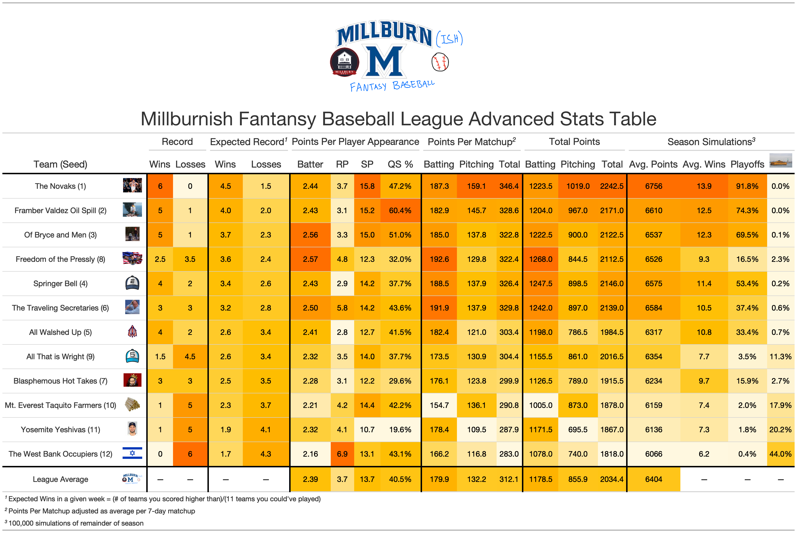
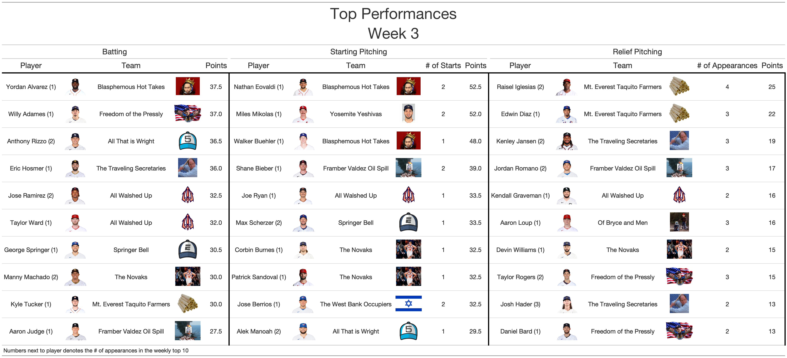

```{r setup, include=FALSE}
knitr::opts_chunk$set(echo = F, warning = F, message = F, error = F)

library(jsonlite)
library(tidyverse)
library(gt)
library(furrr)
library(glue)
library(lubridate)
plan(multiprocess(workers = parallel::detectCores() - 1))
Sys.setenv("VROOM_CONNECTION_SIZE" = 131072 * 2000)

theme_set(theme_bw() + 
            theme(plot.title = element_text(size = 16, hjust = 0.5),
                  axis.title = element_text(size = 14),
                  plot.subtitle = element_text(size = 12, hjust = 0.5),
                  legend.position = "none")
)
set.seed(123)

source('helpers.R')
```

```{r}
### Get data
y <- robust_scrape(glue('http://fantasy.espn.com/apis/v3/games/flb/seasons/{params$season}/segments/0/leagues/49106?view=mTeam'))

### Teams
teams <- jsonlite::flatten(y$teams)
teams <- 
  select(teams, 
         'team_id' = id,
         'division_id' = divisionId,
         location,
         nickname,
         logo,
         'abbreviation' = abbrev,
         'wins' = record.overall.wins,
         'losses' = record.overall.losses,
         'ties' = record.overall.ties) %>% 
  mutate('team' = paste(location, nickname)) %>% 
  select(team_id, division_id, team, everything())

teams$logo[which(teams$team == "The Traveling Secretaries")] <- 'https://i.imgur.com/wll1Ubw.jpg'
write_csv(teams, glue('info/teams_{params$season}.csv'))

### Schedule and Batting + Pitching Points
home_schedule <- NULL
away_schedule <- NULL
schedule <- NULL
batter_points <- sp_points <- rp_points <-  NULL

for(i in 1:20) {
  sp_id <- case_when(
    i < 14 ~ 11 + 7*(i-1),
    i >= 14 ~ 11 + 7*i
  )
  
  x <- robust_scrape(glue("http://fantasy.espn.com/apis/v3/games/flb/seasons/{params$season}/segments/0/leagues/49106?scoringPeriodId={sp_id}&view=mBoxscore"))
  
  
  schedule_ <- x$schedule
  home <- schedule_$home %>% slice(1:120) ### Reg Season
  away <- schedule_$away %>% slice(1:120)
  
  schedule_ <- select(schedule_,
                      'matchup_id' = matchupPeriodId,
                      'game_id' = id) %>% slice(1:120)
  
  home_schedule_ <- 
    select(home, 
           'home_team_id' = teamId,
           'home_total_points' = totalPoints) %>% 
    mutate("home_batting_points" = map_dbl(home$rosterForMatchupPeriod$entries, get_batting_points)) %>% 
    mutate("home_pitching_points" = home_total_points - home_batting_points) 
  
  away_schedule_ <- 
    select(away, 
           'away_team_id' = teamId,
           'away_total_points' = totalPoints) %>% 
    mutate("away_batting_points" = map_dbl(away$rosterForMatchupPeriod$entries, get_batting_points)) %>% 
    mutate("away_pitching_points" = away_total_points - away_batting_points) 
  
  
  batter_points_ <- 
    map2_dfr(home$rosterForMatchupPeriod$entries, 1:120, batting_points_by_game) %>% 
    mutate('team_id' = home$teamId[team_ix]) %>% 
    bind_rows(
      map2_dfr(away$rosterForMatchupPeriod$entries, 1:120, batting_points_by_game) %>% 
        mutate('team_id' = away$teamId[team_ix])
    )
  batter_points <- bind_rows(batter_points, batter_points_)
  
  
  rp_points_ <- 
    map2_dfr(home$rosterForMatchupPeriod$entries, 1:120, rp_points_by_game) %>% 
    mutate('team_id' = home$teamId[team_ix]) %>% 
    bind_rows(
      map2_dfr(away$rosterForMatchupPeriod$entries, 1:120, rp_points_by_game) %>% 
        mutate('team_id' = away$teamId[team_ix])
    )
  rp_points <- bind_rows(rp_points, rp_points_)
  
  
  sp_points_ <- 
    map2_dfr(home$rosterForMatchupPeriod$entries, 1:120, sp_points_by_game) %>% 
    mutate('team_id' = home$teamId[team_ix]) %>% 
    bind_rows(
      map2_dfr(away$rosterForMatchupPeriod$entries, 1:120, sp_points_by_game) %>% 
        mutate('team_id' = away$teamId[team_ix])
    )
  sp_points <- bind_rows(sp_points, sp_points_)
  
  schedule_ <- bind_cols(schedule_, home_schedule_, away_schedule_) %>% 
    mutate_if(is.numeric, function(x) replace(x, x == 0, NA))
  
  
  schedule_ <- 
    schedule_ %>% 
    left_join(select(teams, "home_team" = team, team_id), by = c('home_team_id'= 'team_id')) %>% 
    left_join(select(teams, "away_team" = team, team_id), by = c('away_team_id'= 'team_id')) %>% 
    filter(matchup_id == i)
  
  schedule <- bind_rows(schedule, schedule_)
}

### Relief Starts
for(i in 1:nrow(relief_starts)) {
  week <- relief_starts$week[i]
  player <- relief_starts$player[i]
  ix_rp <- which(rp_points$player == player & rp_points$matchup_id == week)
  ix_sp <- which(sp_points$player == player & sp_points$matchup_id == week)
  rp_points$n_points[ix_rp] <- relief_starts$rp_points[i]
  rp_points$n_games[ix_rp] <- relief_starts$rp_games[i]
  sp_points$n_points[ix_sp] <- relief_starts$sp_points[i]
  sp_points$n_games[ix_sp] <- relief_starts$sp_games[i]
}

```

```{r}
### Team points by week
team_points <- 
  select(schedule, contains("home"), matchup_id, game_id) %>% 
  rename_with(function(x) gsub("home_", "", x)) %>% 
  bind_rows(
    select(schedule, contains("away"), matchup_id, game_id) %>% 
      rename_with(function(x) gsub("away_", "", x))
  )

team_points <- 
  team_points %>% 
  mutate("adj_pts" = case_when(
    matchup_id == 1 ~ total_points * 7/11,
    matchup_id == 14 ~ total_points * 7/10,
    matchup_id == params$matchweek_id & params$midweek ~ 7/(wday(Sys.Date()-2)) * total_points,
    T ~ total_points)) %>% 
  mutate("adj_batting_pts" = case_when(
    matchup_id == 1 ~ batting_points * 7/11,
    matchup_id == 14 ~ batting_points * 7/10,
    matchup_id == params$matchweek_id & params$midweek ~ 7/(wday(Sys.Date()-2)) * batting_points,
    T ~ batting_points)) %>% 
  mutate("adj_pitching_pts" = case_when(
    matchup_id == 1 ~ pitching_points * 7/11,
    matchup_id == 14 ~ pitching_points * 7/10,
    matchup_id == params$matchweek_id & params$midweek ~ 7/(wday(Sys.Date()-2)) * pitching_points,
    T ~ pitching_points)) 

team_points <- 
  team_points %>% 
  left_join(team_points, 
            by = c('matchup_id', 'game_id'),
            suffix = c("", "_opp")) %>% 
  filter(team != team_opp) 

total_team_points <- 
  team_points %>% 
  filter(matchup_id <= params$matchweek_id) %>% 
  group_by(team) %>%
  summarise("total_points" = sum(total_points, na.rm = T),
            "batting_points" = sum(batting_points, na.rm = T),
            "pitching_points" = sum(pitching_points, na.rm = T),
            "adj_batting_pts" = mean(adj_batting_pts, na.rm = T),
            "adj_pitching_pts" = mean(adj_pitching_pts, na.rm = T),
            'adj_pts' = mean(adj_pts, na.rm = T))


### Summary Stats mean points by week
mean_pts_by_week <- 
  group_by(team_points, matchup_id) %>%
  summarise("adj_pts" = mean(adj_pts),
            "adj_batting_pts" = mean(adj_batting_pts),
            "adj_pitching_pts" = mean(adj_pitching_pts))

### Weekly ranks
team_points <- 
  group_by(team_points, matchup_id) %>% 
  mutate("overall_rank" = rank(desc(total_points), ties.method = 'average'),
         "batting_rank" = rank(desc(batting_points), ties.method = 'average'),
         "pitching_rank" = rank(desc(pitching_points), ties.method = 'average')) %>% 
  ungroup()


### Batter points per game
batter_ppg <- 
  batter_points %>% 
  filter(matchup_id <= params$matchweek_id) %>% 
  filter(!is.na(n_games)) %>% 
  inner_join(select(teams, team_id, team)) %>% 
  group_by(team) %>% 
  summarise("batting_ppg" = sum(n_points)/sum(n_games),
            'n_games' = sum(n_games),
            'total' = sum(n_points)) %>% 
  arrange(desc(batting_ppg)) 

### rp points per game
rp_ppg <- 
  rp_points %>% 
  filter(matchup_id <= params$matchweek_id) %>% 
  filter(!is.na(n_games)) %>% 
  inner_join(select(teams, team_id, team)) %>% 
  group_by(team) %>% 
  summarise("rp_ppg" = sum(n_points)/sum(n_games),
            'n_games' = sum(n_games),
            'total' = sum(n_points)) %>% 
  arrange(desc(rp_ppg)) 

### SP Points Per Game
sp_ppg <- 
  sp_points %>% 
  filter(matchup_id <= params$matchweek_id) %>% 
  filter(!is.na(n_games)) %>% 
  inner_join(select(teams, team_id, team)) %>% 
  group_by(team) %>% 
  summarise("sp_ppg" = sum(n_points)/sum(n_games),
            'n_games' = sum(n_games),
            'total' = sum(n_points)) %>% 
  arrange(desc(sp_ppg)) 

### SP Points Per Game
qs_pct <- 
  sp_points %>% 
  filter(matchup_id <= params$matchweek_id) %>% 
  filter(!is.na(n_games)) %>% 
  inner_join(select(teams, team_id, team)) %>% 
  group_by(team) %>% 
  summarise("qs_pct" = sum(n_qs)/sum(n_games),
            'n_games' = sum(n_games),
            'n_qs' = sum(n_qs)) %>% 
  arrange(desc(qs_pct)) 


### Exp Record
exp_standings <- 
  team_points %>% 
  filter(matchup_id <= params$matchweek_id) %>% 
  group_by(team) %>% 
  summarise(
    "win_pct" = mean(total_points > total_points_opp, na.rm = T),
    "exp_win_pct" = mean((12 - overall_rank)/11, na.rm = T),
    'win' = sum(total_points > total_points_opp, na.rm = T) + 0.5 * sum(total_points == total_points_opp, na.rm = T),
    'loss' = params$matchweek_id - win,
    "exp_win" = sum((12 - overall_rank)/11, na.rm = T),
    "exp_loss" = params$matchweek_id - exp_win) %>% 
  inner_join(select(teams, team, division_id, logo)) %>% 
  inner_join(total_team_points) %>% 
  left_join(batter_ppg %>% select(-n_games, -total)) %>% 
  left_join(rp_ppg %>% select(-n_games, -total)) %>% 
  left_join(sp_ppg %>% select(-n_games, -total)) %>% 
  left_join(qs_pct %>% select(-n_games, -n_qs)) %>% 
  arrange(-win_pct, -total_points) %>% 
  arrange(desc(total_points)) 

league_avg <-  
  tibble('team' = 'League Average',
         'division_id' = NA,
         'win' = NA,
         'loss' = NA,
         'exp_win' = NA,
         'exp_loss' = NA,
         'batting_ppg' = weighted.mean(batter_ppg$batting_ppg, batter_ppg$n_games),
         'sp_ppg' = weighted.mean(sp_ppg$sp_ppg, sp_ppg$n_games),
         'rp_ppg' = weighted.mean(rp_ppg$rp_ppg, rp_ppg$n_games),
         'adj_batting_pts' = mean(exp_standings$adj_batting_pts),
         'adj_pitching_pts' = mean(exp_standings$adj_pitching_pts),
         'adj_pts' = mean(exp_standings$adj_pts),
         'batting_points' = mean(exp_standings$batting_points),
         'pitching_points' = mean(exp_standings$pitching_points),
         'total_points' = mean(exp_standings$total_points), 
         'qs_pct' = weighted.mean(qs_pct$qs_pct, qs_pct$n_games))

exp_standings <- bind_rows(exp_standings, league_avg)
```

```{r}
### playoff simulations
mu <- mean(team_points$adj_pts, na.rm = T)
sigma <- sd(team_points$adj_pts, na.rm = T)

team_mus <- 
  group_by(team_points, team) %>% 
  summarise("mean_pts" = mean(adj_pts, na.rm = T),
            "games_played" = max(matchup_id[!is.na(total_points)])) %>% 
  mutate("team_mu" = min(1, games_played/20) * mean_pts  + max(0, (1 - games_played/20)) * mu) %>% 
  pull(team_mu)

team_sigmas <- 
  group_by(team_points, team) %>% 
  summarise("sd_pts" = sd(adj_pts, na.rm = T),
            "games_played" = max(matchup_id[!is.na(total_points)])) %>% 
  mutate("team_sigma" = min(1, games_played/20) * sd_pts  + max(0, (1 - games_played/20)) * sigma) %>% 
  pull(team_sigma)
team_sigmas[is.na(team_sigmas)] <- sigma

names(team_mus) <- sort(unique(team_points$team))
names(team_sigmas) <- sort(unique(team_points$team))

if(params$midweek) {
  na_ix <- is.na(schedule$home_total_points)
} else {
  na_ix <- schedule$matchup_id > params$matchweek_id 
}


df_sims <- future_map_dfr(1:params$nsims, sim_season)

df_sims <- 
  select(df_sims, contains("home"), matchup_id, game_id, sim_id) %>% 
  rename_with(function(x) gsub("home_", "", x)) %>% 
  bind_rows(
    select(df_sims, contains("away"), matchup_id, game_id, sim_id) %>% 
      rename_with(function(x) gsub("away_", "", x))
  )


df_sims <- 
  df_sims %>% 
  select(-contains('batting'), -contains('pitching')) %>% 
  left_join(df_sims %>% select(-contains('batting'), -contains('pitching')),
            by = c('matchup_id', 'game_id', 'sim_id'),
            suffix = c("", "_opp")) %>% 
  filter(team != team_opp)  %>% 
  left_join(select(teams, team_id, division_id), by  = 'team_id')

x <- 
  df_sims %>% 
  group_by(team, division_id, sim_id) %>% 
  summarise('wins' = sum(total_points > total_points_opp),
            'points' = sum(total_points)) %>% 
  ungroup() 

x <- 
  group_by(x, sim_id) %>% 
  group_by(sim_id) %>% 
  mutate("playoffs" = get_playoffs(wins, points)) %>% 
  mutate('last_place' = get_last_place(wins, points))

sim_results <- 
  group_by(x, team) %>% 
  summarise("mean_wins" = round(mean(wins), 1),
            "mean_pts" = round(mean(points)),
            "playoffs" = mean(playoffs),
            'last_place' = mean(last_place))

read_csv('history/historical_playoff_odds_2022.csv') %>%
  filter(matchup_id != params$matchweek_id) %>%
  bind_rows(sim_results %>% mutate('matchup_id' = params$matchweek_id)) %>%
  write_csv('history/historical_playoff_odds_2022.csv')
```


### Advanced Standings
```{r}
df <-
  select(exp_standings,
         team,
         logo,
         win,
         loss,
         exp_win,
         exp_loss,
         batting_ppg,
         sp_ppg,
         rp_ppg,
         adj_batting_pts,
         adj_pitching_pts,
         adj_pts,
         batting_points,
         pitching_points,
         total_points,
         qs_pct)  %>%
  left_join(sim_results)

df$logo[13] <- 'https://i.imgur.com/h3Vd6b8.png'
df$mean_pts[13] <- mean(df$mean_pts[1:12])


gt1 <-
  gt(df) %>%
  
  ### Round Numbers
  fmt_number(columns = c(exp_win, exp_loss, mean_wins), decimals = 1, sep_mark = '') %>%
  fmt_number(columns = c(win, loss, mean_pts), decimals = 0, sep_mark = '') %>%
  fmt_number(columns = c(sp_ppg, rp_ppg, adj_pts, adj_batting_pts, adj_pitching_pts, batting_points, pitching_points, total_points), decimals = 1, sep_mark = '') %>%
  fmt_number(columns = c(batting_ppg), decimals = 2, sep_mark = '') %>%
  fmt_percent(columns = c(qs_pct, playoffs, last_place), decimals = 1, sep_mark = '') %>%
  fmt_missing(columns = everything(), missing_text = "---") %>%
  
  ### Align Columns
  cols_align(align = "center", columns = everything()) %>%
  
  ### Colors
  data_color(columns = c(win, loss, exp_win, exp_loss),
             colors = scales::col_numeric(palette = ggsci::rgb_material('amber', n = 100), domain = c(0, params$matchweek_id))) %>%
  data_color(columns = c(batting_points),
             colors = scales::col_numeric(palette = ggsci::rgb_material('amber', n = 100), domain = range(df$batting_points, na.rm = T))) %>%
  data_color(columns = c(pitching_points),
             colors = scales::col_numeric(palette = ggsci::rgb_material('amber', n = 100), domain = range(df$pitching_points, na.rm = T))) %>%
  data_color(columns = c(total_points),
             colors = scales::col_numeric(palette = ggsci::rgb_material('amber', n = 100), domain = range(df$total_points, na.rm = T))) %>%
  data_color(columns = c(batting_ppg),
             colors = scales::col_numeric(palette = ggsci::rgb_material('amber', n = 100), domain = range(df$batting_ppg, na.rm = T))) %>%
  data_color(columns = c(rp_ppg),
             colors = scales::col_numeric(palette = ggsci::rgb_material('amber', n = 100), domain = range(df$rp_ppg, na.rm = T))) %>%
  data_color(columns = c(sp_ppg),
             colors = scales::col_numeric(palette = ggsci::rgb_material('amber', n = 100), domain = range(df$sp_ppg, na.rm = T))) %>%
  data_color(columns = c(adj_pts),
             colors = scales::col_numeric(palette = ggsci::rgb_material('amber', n = 100), domain = range(df$adj_pts, na.rm = T))) %>%
  data_color(columns = c(adj_batting_pts),
             colors = scales::col_numeric(palette = ggsci::rgb_material('amber', n = 100), domain = range(df$adj_batting_pts, na.rm = T))) %>%
  data_color(columns = c(adj_pitching_pts),
             colors = scales::col_numeric(palette = ggsci::rgb_material('amber', n = 100), domain = range(df$adj_pitching_pts, na.rm = T))) %>%
  data_color(columns = c(qs_pct),
             colors = scales::col_numeric(palette = ggsci::rgb_material('amber', n = 100), domain = range(df$qs_pct, na.rm = T))) %>%
  data_color(columns = c(mean_pts), colors = scales::col_numeric(palette = ggsci::rgb_material('amber', n = 100), domain = range(sim_results$mean_pts))) %>%
  data_color(columns = c(mean_wins), colors = scales::col_numeric(palette = ggsci::rgb_material('amber', n = 100), domain = range(sim_results$mean_wins))) %>%
  data_color(columns = c(last_place, playoffs), colors = scales::col_numeric(palette = ggsci::rgb_material('amber', n = 100), domain = c(0,1))) %>%
  
  ### Borders
  tab_style(
    style = list(
      cell_borders(
        sides = "bottom",
        color = "black",
        weight = px(3)
      )
    ),
    locations = list(
      cells_column_labels(
        columns = gt::everything()
      )
    )
  ) %>%
  tab_style(
    style = list(
      cell_borders(
        sides = "right",
        color = "black",
        weight = px(3)
      )
    ),
    locations = list(
      cells_body(
        columns = c(logo, exp_loss, qs_pct, adj_pts, loss, total_points)
      )
    )
  ) %>%
  tab_style(
    style = list(
      cell_borders(
        sides = "top",
        color = "black",
        weight = px(3)
      )
    ),
    locations = list(
      cells_body(
        rows = team == 'League Average'
      )
    )
  ) %>%
  
  tab_spanner(label = 'Season Simulations', columns = c('mean_pts', 'mean_wins', 'playoffs', 'last_place')) %>%
  tab_spanner(label = 'Total Points', columns = c('batting_points', 'pitching_points', 'total_points')) %>%
  tab_spanner(label = 'Expected Record', columns = c('exp_win', 'exp_loss')) %>%
  tab_spanner(label = 'Record', columns = c('win', 'loss')) %>%
  tab_spanner(label = 'Points Per Player Appearance', columns = c('batting_ppg', 'rp_ppg', 'sp_ppg', 'qs_pct')) %>%
  tab_spanner(label = 'Points Per Matchup', columns = c('adj_batting_pts', 'adj_pitching_pts', 'adj_pts')) %>% 
  
  ### Logos
  text_transform(
    locations = cells_body(c(logo)),
    fn = function(x) {
      web_image(
        url = x,
        height = 30
      )
    }
  ) %>% 
  tab_style(
    style = list(
      cell_fill(color = "white")
    ),
    locations = cells_body(
      columns = c(team, win, loss, exp_win, exp_loss, mean_wins, playoffs, last_place),
      rows = team == 'League Average'
    )
  ) %>%
  tab_style(
    style = list(
      cell_text(weight = "bold")
    ),
    locations = cells_body(
      columns = c(team, win, loss, exp_win, exp_loss, mean_wins, playoffs, last_place),
      rows = team == 'League Average'
    )
  ) %>%
  
  ### Names
  cols_label(
    team = 'Team',
    logo = '',
    win = 'Wins',
    loss = 'Losses',
    exp_win = 'Wins',
    exp_loss = 'Losses',
    batting_ppg = 'Batter',
    sp_ppg = 'SP',
    rp_ppg = 'RP',
    adj_pts = 'Total',
    adj_batting_pts = 'Batting',
    adj_pitching_pts = 'Pitching',
    batting_points = 'Batting',
    pitching_points = 'Pitching',
    total_points = 'Total',
    qs_pct = 'QS %',
    mean_wins = 'Avg. Wins',
    mean_pts = 'Avg. Points',
    playoffs = 'Playoffs',
    last_place = html(ferry),
  ) %>%
  tab_header(
    subtitle = md('**Millburnish Fantansy Baseball League Advanced Stats Table**'),
    title = md('')
  ) %>%
  tab_options(column_labels.font.size = 20,
              heading.title.font.size = 40,
              heading.subtitle.font.size = 40,
              heading.title.font.weight = 'bold',
              heading.subtitle.font.weight = 'bold',
              column_labels.font.weight = 'bold'
              
  ) %>%
  tab_footnote(
    footnote = "Expected Wins in a given week = (# of teams you scored higher than)/(11 teams you could've played)",
    locations = cells_column_spanners(spanners = "Expected Record")
  ) %>%
  tab_footnote(
    footnote = "Points Per Matchup adjusted as average per 7-day matchup",
    locations = cells_column_spanners(spanners = "Points Per Matchup")
  ) %>%
  tab_footnote(
    footnote = "100,000 simulations of remainder of season",
    locations = cells_column_spanners(spanners = "Season Simulations")
  )

# gt1
```

```{r, include = F}
gtsave(gt1, 'figures/stats.png', vwidth = 3000)
```



### Points Breakdown by Week
```{r}
ggplot(team_points,  aes(x = matchup_id, y = adj_pts)) +
  facet_wrap(~team) +
  geom_point(data = select(team_points, -team),
             aes(x = matchup_id, y = adj_pts), fill = "grey", alpha = 0.2) +
  geom_line(data = mean_pts_by_week, alpha = 0.4, lty = 2) +
  geom_point(aes(color = team), size = 2) +
  labs(x = "Week",
       y = "Points",
       subtitle = "Total Points (Normalized to 7 Day Matchup)",
       title = "Fantasy Points by Week") +
  scale_x_continuous(limits = c(1, params$matchweek_id), breaks = 0:params$matchweek_id)

ggplot(team_points,  aes(x = matchup_id, y = adj_batting_pts)) +
  facet_wrap(~team) +
  geom_point(data = select(team_points, -team),
             aes(x = matchup_id, y = adj_batting_pts), fill = "grey", alpha = 0.2) +
  geom_line(data = mean_pts_by_week, alpha = 0.4, lty = 2) +
  geom_point(aes(color = team), size = 2) +
  labs(x = "Week",
       y = "Points",
       subtitle = "Batting Points (Normalized to 7 Day Matchup)",
       title = "Fantasy Points by Week") +
  scale_x_continuous(limits = c(1, params$matchweek_id), breaks = 0:params$matchweek_id)

ggplot(team_points,  aes(x = matchup_id, y = adj_pitching_pts)) +
  facet_wrap(~team) +
  geom_point(data = select(team_points, -team),
             aes(x = matchup_id, y = adj_pitching_pts), fill = "grey", alpha = 0.2) +
  geom_line(data = mean_pts_by_week, alpha = 0.4, lty = 2) +
  geom_point(aes(color = team), size = 2) +
  labs(x = "Week",
       y = "Points",
       subtitle = "Pitching Points (Normalized to 7 Day Matchup)",
       title = "Fantasy Points by Week") +
  scale_x_continuous(limits = c(1, params$matchweek_id), breaks = 0:params$matchweek_id)

```


```{r}
### Pythagorean Record

# * Expected Wins based on weekly rank of points. For example, if you placed 3rd in points for week, that's 9/11 expected wins because you'd defeat 9 of the 11 other teams based on scores for the given week.
library(ggrepel)
ggplot(exp_standings, aes(x = exp_win_pct, y = win_pct)) +
  geom_vline(xintercept = 0.5, lty = 2, alpha = 0.4) +
  geom_hline(yintercept = 0.5, lty = 2, alpha = 0.4) +
  geom_abline(slope = 1, intercept = 0, lty = 2, col = 'red') +
  geom_label(aes(label = team, fill =  win_pct - exp_win_pct), alpha = 0.7, size = 2) +
  scale_fill_viridis_c(labels = function(x)paste0(100*x, "%")) +
  scale_x_continuous(limits = c(0,1), labels = function(x)paste0(100*x, "%")) +
  scale_y_continuous(limits = c(0,1), labels = function(x)paste0(100*x, "%")) +
  theme(legend.position = 'bottom') +
  labs(title = "Pythagorean Win %",
       x = "Expected Win %",
       y = "Actual Win %",
       fill = 'Win% Above Expectation')
```

```{r}
# library(knitr)
# library(kableExtra)
# df_ranks <-
#   team_points %>%
#   filter(!is.na(total_points))  %>%
#   select(team, contains("rank"), matchup_id) %>%
#   pivot_wider(id_cols = 'team',
#               names_from = 'matchup_id',
#               values_from = contains('rank')) %>%
#   arrange(team) %>%
#   mutate_if(is.numeric, function(x) {
#     cell_spec(x,
#               bold = T,
#               color = 'white',
#               background = spec_color(x, end = 0.9, direction = -1, option = 'C'))})
# 
# ix <- c(1, unlist(map(1:7, ~which(grepl(.x, names(df_ranks))))))
# df_ranks <- df_ranks[,ix]
# names(df_ranks) <- c("Team", rep(c("Overall", "Batting", "Pitching"), (ncol(df_ranks) - 1)/3))
# 
# 
# 
# header <- rep(3, (ncol(df_ranks) - 1)/3)
# names(header) <- paste("Week: ", 1:((ncol(df_ranks) - 1)/3))
# header <- c(" " = 1, header)
# df_ranks %>%
#   kable(escape = F) %>%
#   kable_styling("striped") %>%
#   add_header_above(header) %>%
#   add_header_above(c("Ranks By Week" = 3 * length(header) - 2), bold = T, font_size = 24)

```

```{r}
history <- read_csv('history/historical_playoff_odds_2022.csv')

ggplot(history, aes(x = matchup_id, y = playoffs, fill = team)) +
  facet_wrap(~team) +
  geom_line(lwd = 1.2, aes(color = team)) +
  geom_point(size = 2, color = 'black', pch = 21) +
  scale_y_continuous(labels = scales::percent) +
  scale_x_continuous(breaks = 1:params$matchweek_id) +
  labs(x = 'Week',
       y = 'Playoff Odds',
       title = 'Playoff Odds Over Time')
ggsave('figures/playoff_odds.png', height = 9/1.2, width = 16/1.2)

ggplot(history, aes(x = matchup_id, y = last_place, fill = team)) +
  facet_wrap(~team) +
  geom_line(lwd = 1.2, aes(color = team)) +
  geom_point(size = 2, color = 'black', pch = 21) +
  scale_y_continuous(labels = scales::percent) +
  scale_x_continuous(breaks = 1:params$matchweek_id) +
  labs(x = 'Week',
       y = 'Ferry Odds',
       title = 'Ferry Odds Over Time')
```

```{r}
### Top Performers
df_bat <-
  batter_points %>%
  filter(!is.na(n_games)) %>%
  mutate('player_url' = glue('https://a.espncdn.com/combiner/i?img=/i/headshots/mlb/players/full/{player_id}.png&w=350&h=254'),
         'ppg' = n_points/n_games) %>%
  filter(matchup_id <= params$matchweek_id) %>%
  group_by(matchup_id) %>% 
  arrange(-n_points, n_games) %>%
  slice(1:10) %>% 
  left_join(teams) %>%
  group_by(player) %>% 
  mutate('n' = n()) %>% 
  ungroup() %>% 
  mutate(player = paste0(player, ' (', n, ')')) %>% 
  filter(matchup_id == params$matchweek_id) %>%
  select(player, player_url, team, logo, n_points)

names(df_bat) <- paste0(names(df_bat), '_bat')


### Top Performers
df_sp <-
  sp_points %>%
  filter(!is.na(n_games)) %>%
  mutate('player_url' = glue('https://a.espncdn.com/combiner/i?img=/i/headshots/mlb/players/full/{player_id}.png&w=350&h=254'),
         'ppg' = n_points/n_games) %>%
  filter(matchup_id <= params$matchweek_id) %>%
  group_by(matchup_id) %>% 
  arrange(-n_points, n_games) %>%
  slice(1:10) %>% 
  left_join(teams) %>%
  group_by(player) %>% 
  mutate('n' = n()) %>% 
  ungroup() %>% 
  mutate(player = paste0(player, ' (', n, ')')) %>% 
  filter(matchup_id == params$matchweek_id) %>%
  select(player, player_url, team, logo, n_games, n_points)

names(df_sp) <- paste0(names(df_sp), '_sp')

### Top Performers
df_rp <-
  rp_points %>%
  filter(!is.na(n_games)) %>%
  mutate('player_url' = glue('https://a.espncdn.com/combiner/i?img=/i/headshots/mlb/players/full/{player_id}.png&w=350&h=254'),
         'ppg' = n_points/n_games) %>%
  filter(matchup_id <= params$matchweek_id) %>%
  group_by(matchup_id) %>% 
  arrange(-n_points, n_games) %>%
  slice(1:10) %>% 
  left_join(teams) %>%
  group_by(player) %>% 
  mutate('n' = n()) %>% 
  ungroup() %>% 
  mutate(player = paste0(player, ' (', n, ')')) %>% 
  filter(matchup_id == params$matchweek_id) %>%
  select(player, player_url, team, logo, n_games, n_points)

names(df_rp) <- paste0(names(df_rp), '_rp')


df_top <- bind_cols(df_bat, df_sp, df_rp)

gt_top <-
  gt(df_top) %>%
  
  ### Align Columns
  cols_align(align = "center", columns = everything()) %>%
  
  
  tab_spanner(label = 'Relief Pitching', columns = contains('_rp')) %>%
  tab_spanner(label = 'Starting Pitching', columns = contains('_sp')) %>%
  tab_spanner(label = 'Batting', columns = contains('_bat')) %>%
  
  
  
  ### Borders
  tab_style(
    style = list(
      cell_borders(
        sides = "bottom",
        color = "black",
        weight = px(3)
      )
    ),
    locations = list(
      cells_column_labels(
        columns = gt::everything()
      )
    )
  ) %>%
  
  ### Logos
  text_transform(
    locations = cells_body(contains(c('logo', 'player_url'))),
    fn = function(x) {
      web_image(
        url = x,
        height = 50
      )
    }
  ) %>%
  
  tab_style(
    style = list(
      cell_borders(
        sides = "right",
        color = "black",
        weight = px(3)
      )
    ),
    locations = list(
      cells_body(
        columns = contains('points')
      )
    )
  ) %>%
  
  
  ### Names
  cols_label(
    'team_bat' = 'Team',
    'logo_bat' = '',
    'player_url_bat' = '',
    'player_bat' = 'Player',
    'n_points_bat' = 'Points',
    
    'team_sp' = 'Team',
    'logo_sp' = '',
    'player_url_sp' = '',
    'player_sp' = 'Player',
    'n_points_sp' = 'Points',
    'n_games_sp' = '# of Starts',
    
    'team_rp' = 'Team',
    'logo_rp' = '',
    'player_url_rp' = '',
    'player_rp' = 'Player',
    'n_points_rp' = 'Points',
    'n_games_rp' = '# of Appearances'
    
  ) %>%
  tab_header(
    title = md('**Top Performances**'),
    subtitle = md(glue('**Week {params$matchweek_id}**'))
  ) %>%
  tab_options(column_labels.font.size = 20,
              heading.title.font.size = 40,
              heading.subtitle.font.size = 40,
              heading.title.font.weight = 'bold',
              heading.subtitle.font.weight = 'bold',
              column_labels.font.weight = 'bold'
              
  ) %>% 
  tab_source_note('Numbers next to player denotes the # of appearances in the weekly top 10')

```

```{r, include = F}
gtsave(gt_top , 'figures/top_performers.png', vwidth = 3000)
gtsave(gt_top , glue('figures/top_performers/week{params$matchweek_id}.png'), vwidth = 3000)
```



